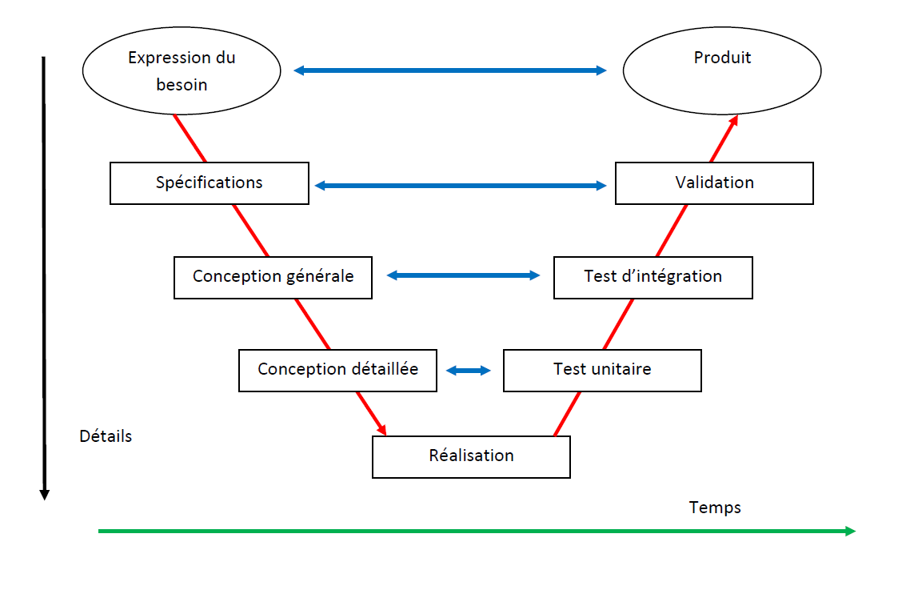

# Méthodes classiques

## Cascade / Waterfall

**Points-clés**

- Les phases s'enchaînent linéairement, les unes après les autres
  
- Le planning de production est établi à l’avance
- Si les besoins du client évoluent, les risques et conséquences sont assumés par le prestataire
- Pas de tolérance à l'erreur (ce qui peut-être la contrainte recherchée)

## V

**Points-clés**

- Les étapes de test sont aussi nombreuses que les étapes de réflexion.
- Il est facile de prévoir les tests à réaliser au moment où on fait la conception
- Idéal en théorie, ce modèle est difficilement applicable car modifier la conception est difficile en pratique
- Déséquilibre fréquent lors de la mise en place (plus d'analyse, moins de validation ou vice-versa)

## Semi-itératif

> Les cycles semi-itératifs sont souvent la base utilisée des méthodes agiles

Sur un gros projet, l'identification du besoin peut être difficile et imprécise.

Pendant ou après le développement (lors des tests) on peut avoir besoin de revenir sur les spécifications, les modifier, changer une librairie ou une maquette, rajouter une fonction...

Les mêmes étapes se suivent mais le cycle se répète.

**Points-clés**

- La phase de définition / analyse permet cadrer un point de départ du projet
- Définition _partielle_ du besoin sous la forme d'un MVP (_Minimum Viable Product_ : v1)
- Les phases de conception, production et validation forment une itération, qui se répète afin de répondre aux évolutions
- Le client ne possède pas de vision d'ensemble / prédictive, entre son expression des besoins et le démarrage du développement
- Le planning et le budget évoluent en fonction des avancées et des requalifications du besoin
- L'accent est mis sur le réalisme, la pédadogie (client), la communication et la mitigation des risques
